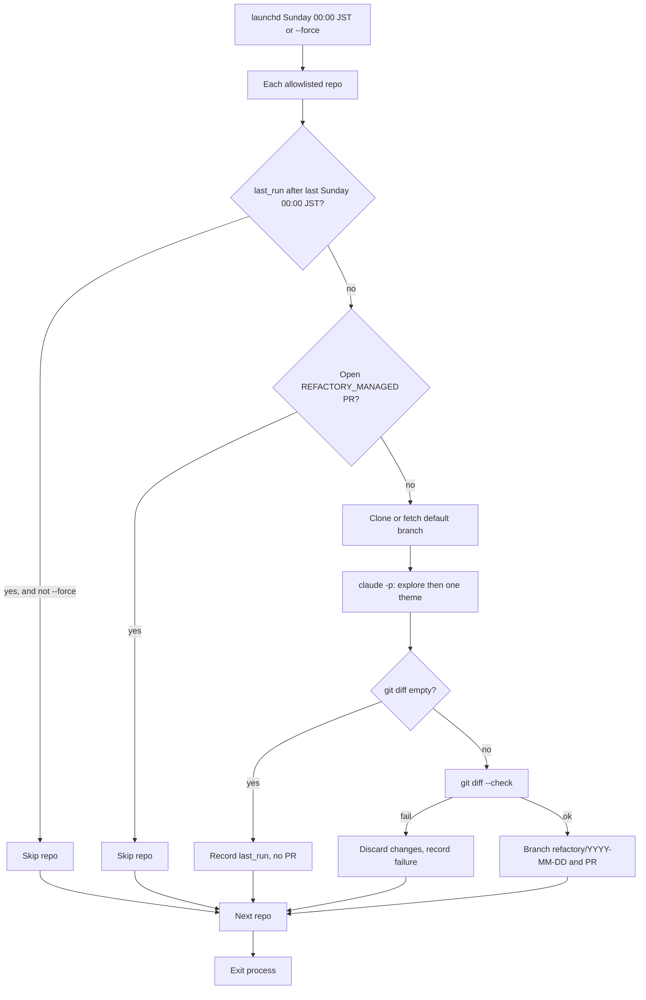

# refactory: weekly behavior-preserving refactors as PRs

Related issue: https://github.com/Senna46/refactory/issues/1

Name: **refactory** (refactor + factory). Independent from Fixooly and bugbot-host.

## Revised requirements

```text
Purpose:
  Cursor / Codex feature work scatters UI pieces and helpers.
  Once a week, read each allowlisted repository, pick one cleanup
  theme that does not change behavior, and open a PR to the default branch.

Repository:
  GitHub: Senna46/refactory (private)
  Local: /Volumes/Samsung980_1TB/github.com/Senna46/refactory

Allowlist:
  - d6e-ai/d6e
  - d6e-ai/d6e-auth
  - d6e-ai/ai-gateway
  - d6e-products/d6e-valuation
  - d6e-ai/ai-keiri

Schedule:
  - launchd StartCalendarInterval: Sunday 00:00 (Mac timezone, expected JST)
  - Code also uses Asia/Tokyo so a wrong machine timezone cannot skip Sunday
  - Run allowlist sequentially, then exit (no hourly poll)
  - Skip a repo when last_run_at >= last Sunday 00:00 JST
  - Friday trial then Sunday still runs (Friday is before that Sunday midnight)
  - After install, run once with --force, then weekly Sundays

Cleanup (behavior unchanged):
  - Deduplicate UI / helpers
  - Remove unused exports and dead code
  - Move scattered files into the existing layout
  - Follow the target repo AGENTS.md / CLAUDE.md
  - Do not change route, API, DB schema, or env meaning

Pull requests:
  - Author Senna46 (PAT) so Cursor Bugbot runs
  - At most one open managed PR per repo
  - No PR when the diff is empty
  - One theme per repo per cycle
  - Light verify only: git diff --check (no pnpm install)

Auth:
  - Clone/fetch: GitHub App installation token (same App as Fixooly)
  - Push and PR create: Senna46 classic PAT (webhooks / Bugbot)
  - Engine: claude -p
```

## Flow



## Implementation notes

- Env prefix: `REFACTORY_*`
- Data: `~/.refactory/`
- Branch: `refactory/YYYY-MM-DD` (JST date)
- Marker: `<!-- REFACTORY_MANAGED -->`
- Claude timeout: 45 minutes
- Claude must not git commit; the daemon commits
- First commit on main is README only; this plan ships on the implementation branch
